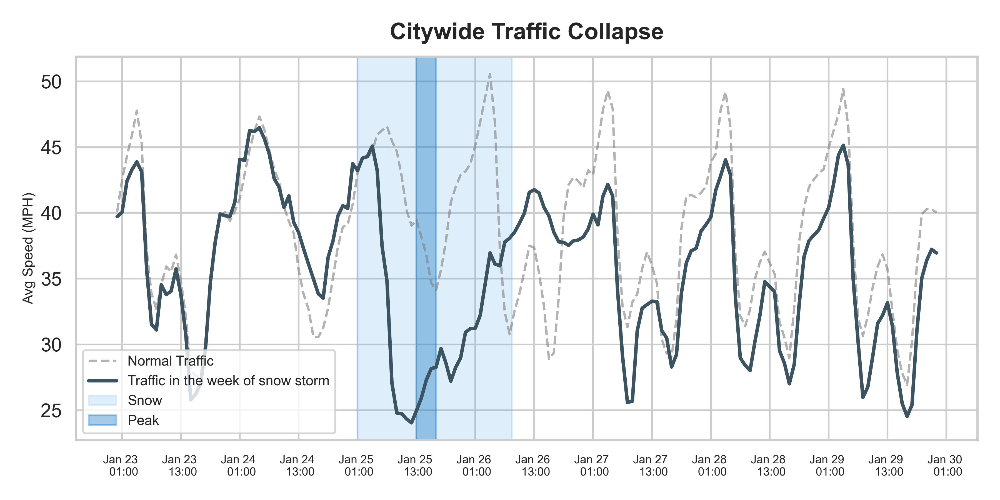
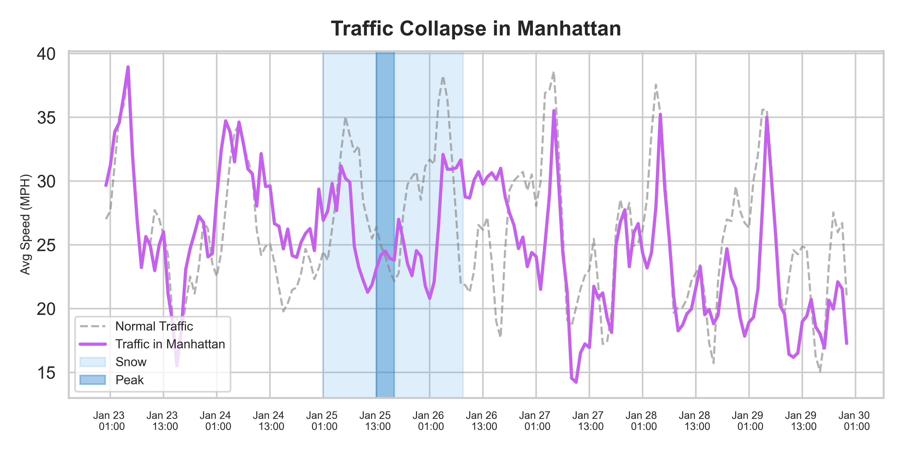
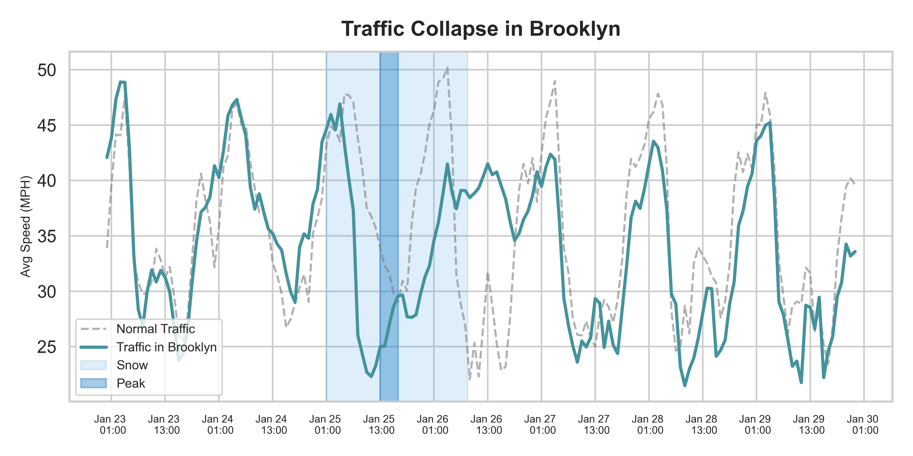
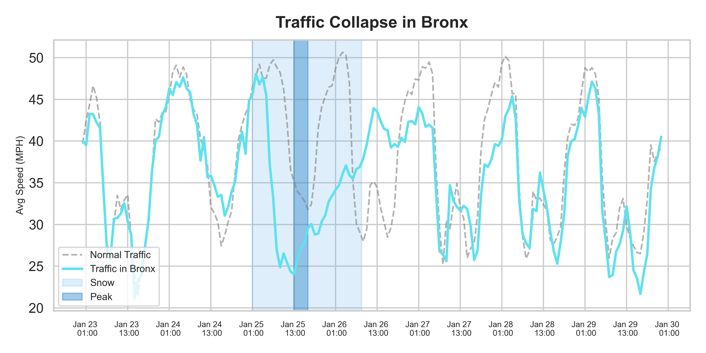
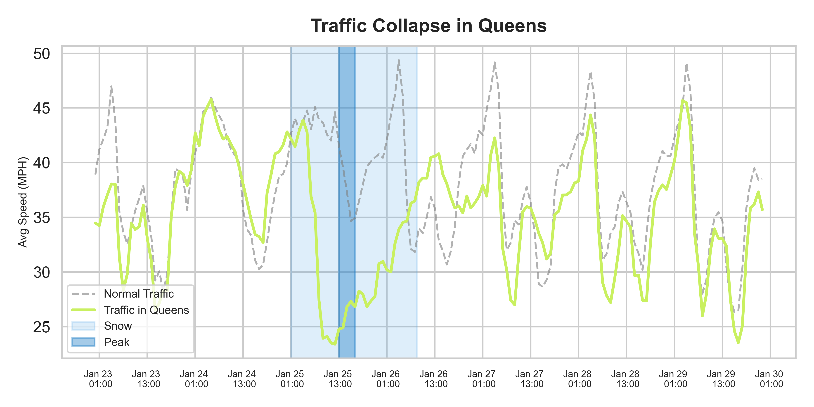

# ❄️ Snowy Sunday on Jan 25th, 2026: Citywide Traffic Collapse Analysis

**A data analysis project investigating the impact of the snowstorm on New York City traffic speeds.**

[](https://www.python.org/)
[](https://jupyter.org/)

## 📖 Project Overview

This project analyzes the "Traffic Collapse" caused by the snowstorm at January 25th in New York City. By comparing traffic data during the storm week against previous week, the traffic collapse is visualized the significant drop in average speeds across the five boroughs.

The analysis highlights the specific collapse and recovery patterns, providing insights into how severe weather impacts urban mobility.


**Key Features:**

* **Time-Series Comparison:** Visualizes "Normal Traffic" vs. "Storm Week Traffic" on the same timeline.
```text
snow_start = pd.Timestamp("2026-01-25 01:00:00")
snow_peak_start = pd.Timestamp("2026-01-25 13:00:00")
snow_peak_end = pd.Timestamp("2026-01-25 17:00:00")
snow_end = pd.Timestamp("2026-01-26 08:30:00")
```

* **Borough Analysis:** Breakdowns of traffic speed impacts for Bronx, Brooklyn, Manhattan, Queens, and Staten Island.


## 📸 Results








During the snowstorm, traffic speeds dropped significantly, and the usual traffic patterns collapsed completely. Just before the storm hit, there was a slight increase in speed, implying that people were rushing to reach their destinations.

As the storm passed, traffic speeds slowly recovered, eventually returning to their normal rising curve. However, Manhattan showed a unique trend compared to the other boroughs. While normal traffic in Manhattan typically spans a wide range of speeds (from 15 to 38 MPH depending on the time of day), during the storm, this range narrowed significantly to between 21 and 33 MPH. This suggests that while the snow generally slowed traffic down, the reduced volume of traffic likely prevented the severe congestion that usually causes the slowest speeds, keeping the flow more consistent.

## 📂 Project Structure

```text
202601_snowysunday/
├── code/                  # Jupyter notebooks and generated images
│   ├── images/            # Charts (Citywide.png, Boroughwide charts)
│   └── code.ipynb         # Main analysis notebook
├── data/                  # Folder for dataset (CSV files - Excluded from Repo)
├── main.py                # Main execution script
├── pyproject.toml         # Project configuration and dependencies
└── README.md              # Project documentation
```

## 🚀 Getting Started
1. Prerequisites
Python 3.13
Git

2. Installation
Clone the repository to your local machine:

```text
Bash
git clone [https://github.com/ek4536/202601_snowysunday.git](https://github.com/ek4536/202601_snowysunday.git)
cd 202601_snowysunday
```

Install the required Python libraries:
```text
Bash
pip install pandas matplotlib seaborn
```

## 3. Data Setup
Note: The raw data files are excluded from this repository for size reasons.

Create a folder named data in the project root.

Add your traffic data CSV files into this folder:

- nyc_storm_fern_traffic.csv

- nyc_traffic_baseline.csv

- nyc_traffic_storm.csv

## 📊 Data Source
Source: NYC Open Data
Dataset: DOT Traffic Speeds NBE (Historical)

## 🛠️ Technologies Used
Python 3.13: Core programming language.
Pandas: For data manipulation and time-series handling.
Matplotlib & Seaborn: For generating the traffic comparison charts.
Jupyter Notebook: For interactive development and visualization.

## 👤 Author
Eunji Kim